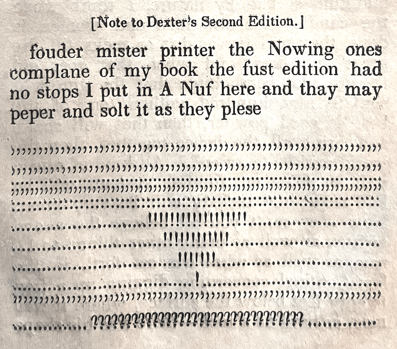
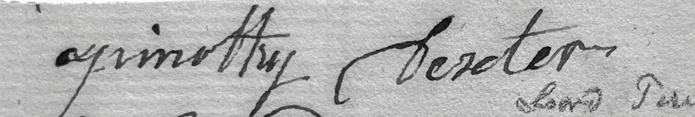

# A Pickler for the Knowing Ones


A translator and generator to produce text in the style of [A Pickle for the Knowing Ones](https://www.gutenberg.org/cache/epub/43453/pg43453-images.html) (1802)
by noted eccentric [Timothy Dexter](https://en.wikipedia.org/wiki/Timothy_Dexter) (1747-1806). The final output is an entry in National Novel Generation Month 2021.

## About the original work and author

[Timothy Dexter](https://en.wikipedia.org/wiki/Timothy_Dexter) was a merchant and "entrepreneur" who married rich and had an unlikely providential career selling literal coals to Newscastle and other dubious business ventures.

Dexter commissioned a local sculpture and architect to build a self-aggrandizing palace in his home town of Newburyport, which he describes in his self-published pamphlet, "A Pickle for the Knowing Ones" (1802):


<blockquote>
the doue
frind father Jorge washeton is in the senter king Addoms is at the Rite
hand the present king at the Left hand father gorge with his hat on the
other hats of the middel king with his sword king Addoms with his Cane
in a grand poster Adtetoude turning his fass towards the first king as
if they was on sum politicks king our present king he is stands hearing
being younger and very deafe in short being one grat felosfer Looks well
East & west and North & south deafe & very deafe the god of Natur has dun
very much for our present king and all our former ones they are all good
I want them to Live for Ever and I beleave thay will it is hard work to
be A king
</blockquote>

Dexter's writing style was unique; in the second and subsequent editions of his pamphlet he responded to criticisms that he failed to use punctuation with the following epigraph:



(His phonetic writing style hints at his speaking style; e.g. <i>learning/larning</i>, <i>slaughter/slarter</i>, <i>thought/thort</i> suggest pronunciations similar to <a href="https://en.wikipedia.org/wiki/Midland_American_English">Midland American English</a>, and <i>isle/oile</i> evokes a modern Irish accent.)

### About the edition used

The digital edition used as a source text is from Project Gutenberg, published posthumously in 1848 by Blanchard & Sargent of Newburyport.

I own a different edition published in 1848 by John G. Tilton. Tilton also published the lithograph of Dexter's mansion reproduced above. The two editions differ in sequencing, material coverage, and even in their spellings (and misspellings!) ome of this I attribute to OCR/transcriber error, but many differences certainly exist in the sources. These were inexpensive pamphlets distributed to make fun of Dexter, not scholarly works. My edition features amusingly dry footnotes from the editor.

## Project goals

Transform a modern text with ideological similarity to Dexter's business initiatives to a Dexter-like rendering.

This repo contains the following utilities:

[] A dictionary generator, to iterate through the source of _A Pickle for the Knowing Ones_ and generate a map of Dexter's spellings to standard English. The program should suggest words, skip known words, and store the dictionary.

[] A script, `pickler.py`, to take an input text and turn it into a Dexter-style rendering including puncutation treatment.

[] A programmatic downloader for the source data, `filings.py` to be SEC quarterly earnings reports from Telsa, Inc.

### Dictionary generator

This loops through the source text, breaking on word boundaries, and generates an ordered data structure like the following:

```
[original_word, spellchecked_word, is_spellchecked]
```

Initially the first two values are the same, and the last is false.

In the spellcheck pass, a text-based UI assists the transcriber by showing a window of context, with a selection
of spell-checked options (via autocomplete), or the transcriber can type in a new word:

```
╭────────────────────────────────────────────────────────────────────────────────╮
│ put in A Nuf here and thay may pepper and solt itt as they plese    ,, ,                                                                   │
╰────────────────────────────────────────────────────────────────────────────────╯
? [solt]: salt

```

Any words added replace the `spellchecked_word` value in the dictionary, and flip the `is_spellchecked` bit. Re-running the program will resume at the last-checked word. On control-C (or at completion), the dictionary is saved.

(Several manual passes were later made over the dictionary both to correct OCR errors in the Gutenberg-derived scan, but also to add additional Dexter errors that were accidentally _corrected_ by the OCR software, based on comparing with my original edition.)

### The Pickler

This takes an input text, as a list of strings, remaps all words according to the dictionary generated above, and removes all puncutation. The puncutation is then appended to the end, as Dexter did.

A test suite generates the process on a few samples:

**Source:**

```
It is a truth universally acknowledged, that a single man (??) loves punctuation!!
```

**Output:**

```
Itt is a trouth universally acknowledged that a single man leovs punctuation ,(??)!!
```

## `filings.py`

This downloads recent quarterly earnings reports (10-Q filings) from the [EDGAR database](https://www.sec.gov/edgar/searchedgar/companysearch.html) provided by the US Securities and Exchange Commission using [sec-edgar-downloader](https://github.com/jadchaar/sec-edgar-downloader), parses the reports, then passes the output through the pickler.

EDGAR reports are in a bespoke SGML format with wrapped HTML; this extracts the HTML blob, passes the text nodes to `pickler.py`, updates them in replace, then writes out the transformed HTML.

Using the HTML-to-text capability of [w3m](http://w3m.sourceforge.net/) then produces nicely-formatted plain text.

### The output

66,369 words derived from three years of Tesla quarterly reports and amendments. Examples:

```
Between August 10 2018 & September 6 2018 nine purported stockholder class axxons were filed a
ganst Tesla & Elon Musk in connection with Elon Musks August 7 2018 Twitter post that he wos
considering taking Tesla private All of the suits are noue pending in the US District Cort fower
the Northern District of California Although the complaints vary in certain respects thay each
purport to assert claims fower violations of federal secourties laws related to Mr Musks statement
& seek unspecified compensatory damages & other relief on behalf of a purported class of purchasers
of Teslas secourties Plaintiffs filed ther consoalated complaint on Janeuarey 16 2019 & added ass
defendants the members of Teslas board of directors  The now-consolidated purported stockholder
class axon ass staed while the issue of selection of lead counsel ass briefed & argued befor the US
Cort of Appeals fower the Ninth Circuit  We beleuv that the claims have noe merit & intend to
defend a ganst them vigorously Wee are unable to estimate the potential lose or range of lose
associated with these claims
```

```
Our production vehicle fleet includes our Model S premium sedan & our Model X SUV which are our
highest-performance vehicles & our Model 3 a lower-priced sedan designed fower the mass markett Wee
continue to enhance our vehicle offerings with enhanced Autopilot options internet connectivity &
free over-the-air software updates to provide additional safety convenience & performance features
In March 2019 wee unveiled Model Y a compact SUV utilizing the Model 3 platform which wee expect to
produce ot hie volumes bi the eand of 2020 In addition wee have several future electric vehicles in
our product pipeline including Tesla Semi a pickup truck & a noue version of the Tesla Roadster
```

```
The trading price of our comon stock has bin highly volatile & could continue to be subject to wide
fluctuations in response to various factors sum of which are beyond our control Our comon stock has
experienced an intra-day trading hie of 38746 per share & n low of 23113 per share over the last 52
weeks The stock markett in ginrel & the markett fower technology companies in particular has
experienced extreme price & volume fluctuations that have offen bin unrelated or disproportionate
to the operating performance of thous companies In particular n larg proportion of our comon stock
has bin & mak continue to be traded bi short sellers which mak puts pressure on the supply & demand
fower our comon stock fouder influencing volatility in its markett price Public perception & other
factors outside of our control mak additionally impact the stock price of companies lik us that
garner n disproportionate degree of public attention regardless of actual operating performance In
addition in the past follering periods of volatility in the overall markett & the markett price 27
n particular companys secourties secourties class axon litigation has offen bin instituted a ganst
these companies Moreover stockholder litigation lik this has bin filed a ganst us in the past While
wee are continuing to defend such axxons vigorously aney judgment a ganst us or aney future
stockholder litigation could result in substantial costs & n diversion of our managements attention
& resources
```

and in closing:

```


Segnetoure Page- Letter]


-....(“”),,,,(“”),,(“”),,,,,(“”),,(,“”),,(“”),,,,..,,,,;,,,,,,,,:..():().()“”:“()();,()(),()-,,-()
-;”().()“”:“();,()(),()-,,-()-;..(“”):();(),,,.;(),...,:(),,,,,,’().(),,,,,.(),,,,...
(),“”,“”,“”,“”.(),,,/,,,.(),,,,,,/...,,--(’,,&,,),,,...,,(--).......()...,,...,.,.,:_//::.,://:::/
/::.,,,://::://::.,..,://::,,: ,..,--://::,,: ,..,--://::.,,: ,..,--://::,,: ,..,--://::.,,://:::/
/::,,://::://::,://.:.:.,://::,:,--://::.,://::.-.,“[***]”....(“”),,,,(“”),,(“”),,,,,,,(,“”),,,.,,
(,“”),,,,..,,,;,,,,,,,:..():().“[***]”.().“”:“‘’,,,,,,,,,,,,,,,,..”().,,“”:“‘’(),,[***],,(),,,,
[***],,,,.”().():“() ,,,,,,()/(),,,,,,’,,,./,,()/(),,,,,,,,’,,,.,,,,-,.,---,,--,,,(),,.’..(),.().”
().()().():“(),,,,, .(,’,-,)”...(“”):();(),,,.;(),...,:(),,,,,,’().(),,,,,.(),,,,...(),“”,“”,“”,“”.
(),,,/,,,.(),,,,,,/...,,--(’,,&,,),,,...,,(--).......()...,,.,.,:_//______________::.,,,:_//
____________________:::_//___________________::.,..,:_//_____________________::,,: ,..,--:_//
_____________________::,,: ,..,--:_//_____________________::.,,: ,..,--:_//
_____________________::,,: ,..,--:_//_____________________::.,,:__//_________________:::_//
____________::,,:__//_________________:::_//____________::,:_//._________________:.:.,:__//
_______________::,:,--:__//_______________::.,:__//_______________::.-..#&#&(“”)(“”),-,,,,;,(.)
(“”),,,;,.(“”),,,.,“”,,“.”,,.,...§.()§.():(“”) .:(“”) ..,-,.,,.,,,..[].://::://,.://::://,://::://
-_.,..-()☒(),☐():-,.()-()(....),()()()-(’,)()  ()(“”)(),() .☒☐-(§.)().☒☐,,-,,.“,”“,”“”,“” -:☒☐-☐☐☐,
().☐(-).☐☒,,,, ’.,.-,..
().’..........---.-,,,,,,,,,,,,.“,”“,”“,”“,”“,”“,”“,”“,”“,”“,”“”-,-.,--.,-.--,,,,  ,“”-.-..,.(,)
(),,$,,$,,,,,,,,,,,,,,,,,,,,,,,,,,,,,,,,,,--,,—,,,,,,,,,,,,,$,,$,,$,,$,,,,,,,,,,,,-,,,,,,,,-,,,,,,,,,,,,-,,,,,,,,

```


